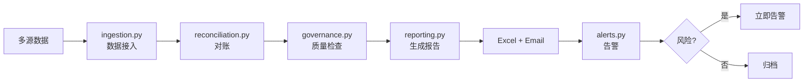

# 项目架构

## 整体设计

## 模块说明

### 接入层（src/ingestion.py）
- 从多个数据源拉取（SQL / API / 文件）
- 统一格式化为内部 schema
- 增量更新（基于时间戳）

### 对账层（src/reconciliation.py）
- 跨源对比（订单系统 vs 财务系统 vs 银行流水）
- 识别差异行
- 输出对账报告

### 治理层（src/governance.py）
- 完整性检查（必填字段）
- 一致性检查（业务规则）
- 及时性检查（数据延迟）
- 唯一性检查（主键）

### 报告层（src/reporting.py）
- 生成 Excel 月报
- 包含：核心指标 + 风险提示 + 趋势图
- 模板化设计（`configs/report_template.xlsx`）

### 告警层（src/alerts.py）
- 风险阈值监控
- 异常自动告警
- 邮件 / 钉钉 / Slack 通知

### 管道编排（src/pipeline.py）
- 串联所有模块
- 失败重试 + 断点续传
- 审计日志

## 数据流

1. **接入**：每天 02:00 拉取昨日数据
2. **对账**：3 源对比，输出差异
3. **治理**：质量检查，发现问题
4. **报告**：生成 Excel 月报
5. **告警**：超阈值立即通知
6. **归档**：原始数据入仓

## 关键技术决策

| 决策 | 备选 | 选择 | 原因 |
|------|------|------|------|
| 调度 | Cron / Airflow | **Cron** | 简单场景够用 |
| 数据库 | PostgreSQL / MySQL | **PostgreSQL** | 金融常用，事务强 |
| 测试 | 手动 / 自动化 | **pytest** | CI 集成，覆盖率报告 |
| 报告格式 | PDF / Excel | **Excel** | 财务习惯 |
| 告警 | 邮件 / 短信 | **邮件 + 钉钉** | 覆盖 + 即时 |

## 风险监控指标

| 指标 | 阈值 | 行动 |
|------|------|------|
| 对账差异率 | > 5% | 立即告警 |
| 数据延迟 | > 4 小时 | 告警 |
| 必填字段缺失 | > 1% | 告警 |
| 月度 GMV 环比 | < -20% | 告警 |
